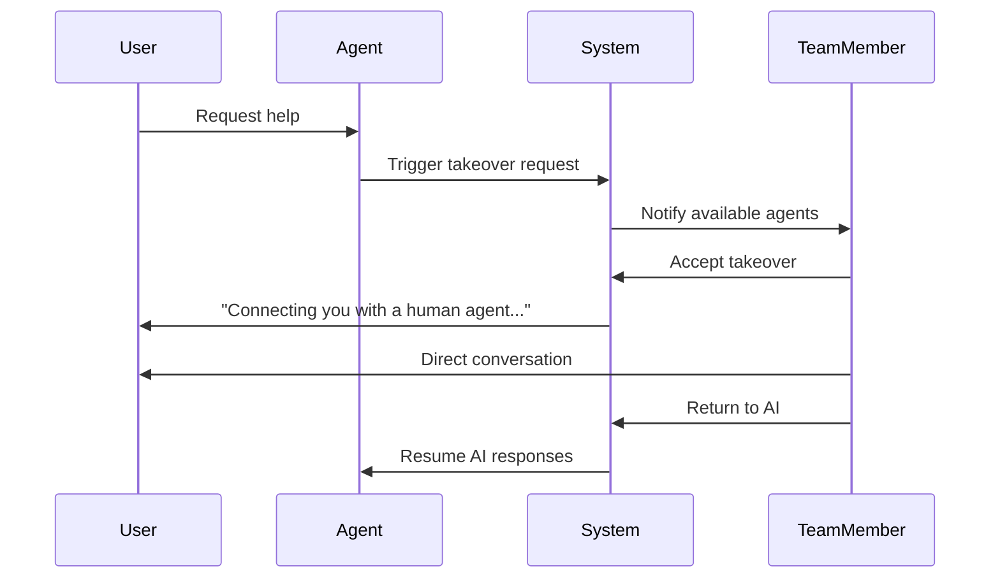

# ChatPad Platform Architecture

## Overview

ChatPad is a multi-tenant AI agent platform that enables businesses to deploy intelligent conversational agents for customer engagement, lead capture, and automated support. The platform features full RAG (Retrieval Augmented Generation) capabilities, human takeover, white-label branding, and comprehensive integrations.

## System Architecture

### Multi-Tenant Structure

```
Platform Level (Super Admin)
├── Organizations (Tenants)
│   ├── Agents (AI Configurations)
│   │   ├── Knowledge Sources (RAG)
│   │   └── Agent Tools (Function Calling)
│   ├── Conversations
│   │   ├── Messages
│   │   └── Takeovers (Human Intervention)
│   ├── Leads
│   ├── Integrations
│   │   ├── Webhooks
│   │   └── API Keys
│   └── Team Members
└── Plans & Subscriptions
```

## Database Schema

### Core Tables

#### `organizations`
Multi-tenant foundation for the platform.
```sql
- id: uuid (PK)
- name: text
- slug: text (unique, used in URLs)
- created_at: timestamp
- settings: jsonb (org-wide configuration)
```

#### `org_members`
Links users to organizations with specific roles.
```sql
- id: uuid (PK)
- org_id: uuid (FK -> organizations)
- user_id: uuid (FK -> auth.users)
- role: org_role (owner, admin, member)
- created_at: timestamp
```

#### `plans`
Subscription tier definitions.
```sql
- id: uuid (PK)
- name: text (Basic, Advanced, Pro)
- price_monthly: integer (cents)
- price_yearly: integer (cents)
- features: jsonb
- limits: jsonb {
    max_agents: integer,
    max_conversations_per_month: integer,
    max_messages_per_conversation: integer,
    max_knowledge_sources: integer,
    max_api_calls_per_month: integer
  }
```

#### `subscriptions`
Organization to plan mapping with Stripe integration.
```sql
- id: uuid (PK)
- org_id: uuid (FK -> organizations, unique)
- plan_id: uuid (FK -> plans)
- stripe_subscription_id: text
- status: text (active, past_due, canceled)
- current_period_start: timestamp
- current_period_end: timestamp
```

#### `agents`
AI agent configurations.
```sql
- id: uuid (PK)
- org_id: uuid (FK -> organizations)
- name: text
- description: text
- system_prompt: text (personality/instructions)
- model: text (google/gemini-2.5-flash, etc.)
- temperature: float (0.0-1.0)
- max_tokens: integer
- status: agent_status (draft, active, paused)
- deployment_config: jsonb {
    widget_enabled: boolean,
    hosted_page_enabled: boolean,
    api_enabled: boolean
  }
- created_at: timestamp
- updated_at: timestamp
```

#### `knowledge_sources`
RAG knowledge base with vector embeddings.
```sql
- id: uuid (PK)
- agent_id: uuid (FK -> agents)
- org_id: uuid (FK -> organizations)
- type: knowledge_type (pdf, url, api, json, xml, csv)
- source: text (file path, URL, endpoint)
- content: text (extracted/parsed content)
- embedding: vector(1536) (OpenAI embeddings)
- metadata: jsonb
- status: text (processing, ready, error)
- created_at: timestamp
```

#### `conversations`
Chat sessions with 6-month retention.
```sql
- id: uuid (PK)
- agent_id: uuid (FK -> agents)
- org_id: uuid (FK -> organizations)
- status: conversation_status (active, human_takeover, closed)
- metadata: jsonb (user info, session data)
- created_at: timestamp
- updated_at: timestamp
- expires_at: timestamp (created_at + 6 months)
```

#### `messages`
Individual chat messages.
```sql
- id: uuid (PK)
- conversation_id: uuid (FK -> conversations)
- role: text (user, assistant, system)
- content: text
- metadata: jsonb (sources, tokens, model)
- created_at: timestamp
```

#### `leads`
Captured lead information from conversations.
```sql
- id: uuid (PK)
- org_id: uuid (FK -> organizations)
- conversation_id: uuid (FK -> conversations)
- name: text
- email: text
- phone: text
- company: text
- status: lead_status (new, contacted, qualified, converted)
- data: jsonb (custom fields)
- created_at: timestamp
```

#### `webhooks`
Outbound webhook configurations.
```sql
- id: uuid (PK)
- org_id: uuid (FK -> organizations)
- name: text
- url: text
- events: text[] (conversation.ended, lead.captured, etc.)
- headers: jsonb
- active: boolean
- created_at: timestamp
```

#### `api_keys`
Organization API keys for programmatic access.
```sql
- id: uuid (PK)
- org_id: uuid (FK -> organizations)
- name: text
- key: text (hashed)
- key_preview: text (last 4 chars)
- permissions: text[]
- last_used_at: timestamp
- created_at: timestamp
```

#### `conversation_takeovers`
Human intervention tracking.
```sql
- id: uuid (PK)
- conversation_id: uuid (FK -> conversations)
- taken_over_by: uuid (FK -> auth.users)
- taken_over_at: timestamp
- returned_to_ai_at: timestamp
- reason: text
```

#### `org_branding`
White-label customization (Pro plan).
```sql
- id: uuid (PK)
- org_id: uuid (FK -> organizations, unique)
- logo_url: text
- primary_color: text
- secondary_color: text
- custom_domain: text
- hide_powered_by: boolean
- created_at: timestamp
```

### Enums

```sql
-- Organization member roles
CREATE TYPE org_role AS ENUM ('owner', 'admin', 'member');

-- Agent lifecycle status
CREATE TYPE agent_status AS ENUM ('draft', 'active', 'paused');

-- Conversation state
CREATE TYPE conversation_status AS ENUM ('active', 'human_takeover', 'closed');

-- Lead workflow status
CREATE TYPE lead_status AS ENUM ('new', 'contacted', 'qualified', 'converted');

-- Knowledge source types
CREATE TYPE knowledge_type AS ENUM ('pdf', 'url', 'api', 'json', 'xml', 'csv');

-- Platform-level roles (extends existing app_role)
ALTER TYPE app_role ADD VALUE 'super_admin';
```

## User Roles & Permissions

### Platform Level
- **Super Admin**: Full platform access, manages organizations and plans

### Organization Level
- **Owner**: Full org access, billing, branding, team management
- **Admin**: Manage agents, conversations, leads, integrations
- **Member**: View-only access to conversations and leads

## Plan Tiers

### Basic Plan
**Target**: Small businesses, testing
- **Price**: $49/month or $470/year
- **Features**:
  - 1 agent
  - 500 conversations/month
  - 50 messages per conversation
  - 5 knowledge sources
  - 10,000 API calls/month
  - Widget deployment only
  - Email support

### Advanced Plan
**Target**: Growing businesses
- **Price**: $149/month or $1,430/year
- **Features**:
  - 5 agents
  - 2,000 conversations/month
  - 100 messages per conversation
  - 25 knowledge sources
  - 50,000 API calls/month
  - Widget + hosted page deployment
  - Webhooks (5 max)
  - Priority email support

### Pro Plan
**Target**: Enterprises, agencies
- **Price**: $399/month or $3,830/year
- **Features**:
  - Unlimited agents
  - 10,000 conversations/month
  - 200 messages per conversation
  - Unlimited knowledge sources
  - 200,000 API calls/month
  - All deployment methods (widget, hosted, API)
  - Unlimited webhooks
  - White-label branding
  - Custom domain
  - Dedicated support
  - 12-month conversation retention (vs 6-month default)

## Agent Deployment Methods

### 1. Embeddable Widget
JavaScript snippet that adds a chat bubble to any website.

**Implementation**:
```html
<script src="https://chatpad.app/widget.js"></script>
<script>
  ChatPad.init({
    agentId: 'your-agent-id',
    apiKey: 'your-api-key'
  });
</script>
```

### 2. Hosted Chat Page
Standalone chat interface at a unique URL.

**URL Format**: `https://chat.chatpad.app/{org-slug}/{agent-slug}`

**White-label URL**: `https://chat.yourdomain.com` (Pro plan only)

### 3. API Access
REST API for custom integrations.

**Endpoint**: `POST /api/v1/chat`
```json
{
  "agentId": "uuid",
  "conversationId": "uuid (optional)",
  "message": "string",
  "metadata": {}
}
```

## Knowledge Base & RAG

### Supported Sources
- **PDF**: Text extraction, chunking, embedding
- **URL**: Web scraping, content extraction
- **API**: JSON/XML response parsing
- **JSON**: Direct data import
- **XML**: Structured data parsing
- **CSV**: Tabular data import

### Processing Pipeline
1. **Ingestion**: Upload/fetch source content
2. **Extraction**: Parse content based on type
3. **Chunking**: Split into semantic chunks (~500 tokens)
4. **Embedding**: Generate vector embeddings via OpenAI
5. **Storage**: Save to `knowledge_sources` with pgvector
6. **Query**: Vector similarity search during conversations

### RAG Flow
```
User Message → Vector Search → Top 3 Relevant Chunks → 
Context Injection → AI Response with Sources
```

## Human Takeover

### Trigger Mechanisms
1. User explicitly requests human assistance
2. Agent detects sensitive topic
3. Agent confidence below threshold
4. Manual takeover by team member

### Takeover Flow


### Implementation
- Real-time notifications via Supabase Realtime
- Conversation status changes to `human_takeover`
- All messages during takeover tagged with `taken_over_by`
- Team member can return conversation to AI at any time

## Integrations

### Webhooks
Outbound HTTP calls triggered by events:
- `conversation.started`
- `conversation.ended`
- `lead.captured`
- `lead.status_changed`
- `conversation.takeover_requested`

**Webhook Payload**:
```json
{
  "event": "lead.captured",
  "timestamp": "2024-01-15T10:30:00Z",
  "data": {
    "leadId": "uuid",
    "name": "John Doe",
    "email": "john@example.com",
    "conversationId": "uuid"
  }
}
```

### API Keys
- Scoped to organization
- Rate-limited based on plan
- Usage tracking for billing
- Revocable at any time

## Security & RLS

### Row-Level Security Policies

**Super Admin Bypass**:
```sql
CREATE POLICY "Super admins bypass all restrictions"
ON all_tables FOR ALL
USING (is_super_admin(auth.uid()));
```

**Organization-Scoped Access**:
```sql
CREATE POLICY "Users can access their org data"
ON organizations FOR ALL
USING (
  EXISTS (
    SELECT 1 FROM org_members
    WHERE org_id = organizations.id
    AND user_id = auth.uid()
  )
);
```

**Public Chat Access**:
```sql
CREATE POLICY "Public can create conversations"
ON conversations FOR INSERT
WITH CHECK (auth.uid() IS NULL); -- Anonymous access
```

### Security Functions

```sql
-- Check if user is platform super admin
CREATE FUNCTION is_super_admin(user_id uuid)
RETURNS boolean AS $$
  SELECT EXISTS (
    SELECT 1 FROM user_roles
    WHERE user_id = $1
    AND role = 'super_admin'
  );
$$ LANGUAGE sql STABLE SECURITY DEFINER;

-- Check if user has org admin privileges
CREATE FUNCTION is_org_admin(user_id uuid, org_id uuid)
RETURNS boolean AS $$
  SELECT EXISTS (
    SELECT 1 FROM org_members
    WHERE user_id = $1
    AND org_id = $2
    AND role IN ('owner', 'admin')
  );
$$ LANGUAGE sql STABLE SECURITY DEFINER;

-- Get user's role in organization
CREATE FUNCTION get_user_org_role(user_id uuid, org_id uuid)
RETURNS org_role AS $$
  SELECT role FROM org_members
  WHERE user_id = $1
  AND org_id = $2
  LIMIT 1;
$$ LANGUAGE sql STABLE SECURITY DEFINER;
```

## AI Integration

### Lovable AI Gateway
- **Endpoint**: `https://ai.gateway.lovable.dev/v1/chat/completions`
- **Default Model**: `google/gemini-2.5-flash`
- **Streaming**: Server-Sent Events (SSE)
- **Authentication**: `LOVABLE_API_KEY` (auto-configured)

### Model Selection
- **Basic Plan**: `google/gemini-2.5-flash-lite` (fastest, cheapest)
- **Advanced Plan**: `google/gemini-2.5-flash` (balanced)
- **Pro Plan**: Any model (including `google/gemini-2.5-pro`, `openai/gpt-5`)

### Token Management
- Track usage per conversation
- Calculate costs based on model
- Enforce plan limits
- Alert when approaching limit

## Data Retention

### Conversations
- **Default**: 6 months from creation
- **Pro Plan**: 12 months
- **Cleanup**: Automated via scheduled edge function
- **Archive**: Optional export before deletion (Pro)

### Deleted Items
- **Soft Delete**: Mark as deleted but retain for 30 days
- **Hard Delete**: Permanent removal after 30 days
- **Audit Log**: Track all deletions

## Performance Considerations

### Database Optimization
- Indexes on `org_id` for all tenant tables
- Composite index on `(conversation_id, created_at)` for messages
- Vector index (HNSW) on `knowledge_sources.embedding`
- Partition `conversations` table by month for better performance

### Caching Strategy
- Cache agent configurations in Redis
- Cache plan limits for quick validation
- Cache knowledge embeddings for fast RAG queries

### Real-time Optimization
- Use Supabase Realtime for conversation updates
- Implement SSE for AI streaming (not WebSockets for cost)
- Debounce typing indicators

## Billing & Usage Tracking

### Stripe Integration
- Subscription management
- Automatic plan upgrades/downgrades
- Proration handling
- Failed payment retry logic

### Usage Metering
```sql
CREATE TABLE usage_metrics (
  id uuid PRIMARY KEY DEFAULT gen_random_uuid(),
  org_id uuid REFERENCES organizations(id),
  period_start timestamp,
  period_end timestamp,
  conversations_count integer,
  messages_count integer,
  api_calls_count integer,
  tokens_used integer,
  overage_amount integer -- in cents
);
```

### Overage Handling
- **Basic/Advanced**: Hard limits (block at limit)
- **Pro**: Soft limits (allow with overage charges at $0.10/1000 tokens)

## White-Label Branding (Pro)

### Customization Options
- Upload custom logo
- Set primary/secondary colors
- Configure custom domain (CNAME setup)
- Hide "Powered by ChatPad" footer
- Custom email templates

### Implementation
- Store branding config in `org_branding` table
- Apply theme dynamically in chat widget
- Use organization slug for hosted pages
- Custom domain DNS verification

## Monitoring & Analytics

### Platform Metrics (Super Admin)
- Total organizations
- Active subscriptions by plan
- Total conversations/messages
- Revenue metrics
- API usage trends

### Organization Metrics
- Conversations over time
- Most active agents
- Lead conversion rate
- Average response time
- Customer satisfaction (CSAT)
- Token usage and costs

### Alerts
- Approaching plan limits
- Failed webhook deliveries
- High error rates
- Inactive agents
- Expiring trials

## API Reference

### Authentication
All API requests require an API key in the `Authorization` header:
```
Authorization: Bearer {api-key}
```

### Endpoints

#### Chat
```
POST /api/v1/chat
Body: { agentId, conversationId?, message, metadata? }
Response: { conversationId, messageId, response, sources? }
```

#### Conversations
```
GET /api/v1/conversations
GET /api/v1/conversations/{id}
POST /api/v1/conversations/{id}/takeover
POST /api/v1/conversations/{id}/return
DELETE /api/v1/conversations/{id}
```

#### Leads
```
GET /api/v1/leads
GET /api/v1/leads/{id}
PUT /api/v1/leads/{id}
```

#### Knowledge
```
POST /api/v1/knowledge/upload
GET /api/v1/knowledge/sources
DELETE /api/v1/knowledge/sources/{id}
```

## Development Roadmap

### Phase 1: Foundation (Current)
- ✓ Database schema
- ✓ Authentication & authorization
- ✓ Core multi-tenant setup

### Phase 2: Core Features
- Agent management
- Chat system with AI
- Basic deployments (widget, hosted)

### Phase 3: Advanced Features
- Knowledge base & RAG
- Human takeover
- Leads & webhooks

### Phase 4: Business Features
- Stripe billing
- Usage tracking
- Plan enforcement

### Phase 5: Premium Features
- White-label branding
- Custom domains
- Advanced analytics

### Phase 6: Scale & Optimize
- Performance tuning
- Caching layer
- Advanced monitoring

## Technical Stack

### Frontend
- React 18 with TypeScript
- Vite for bundling
- Tailwind CSS for styling
- TanStack Query for state management
- Radix UI components

### Backend
- Supabase (PostgreSQL)
- Supabase Edge Functions (Deno)
- Supabase Realtime
- Supabase Storage
- pgvector for embeddings

### AI/ML
- Lovable AI Gateway
- OpenAI for embeddings
- Google Gemini models

### Infrastructure
- Supabase Cloud
- Stripe for payments
- Resend for emails

### Development
- Git for version control
- GitHub for CI/CD
- Lovable for development

## Support & Documentation

### User Documentation
- Getting started guide
- Agent builder tutorial
- Knowledge base setup
- Deployment guides
- API documentation
- Webhook examples

### Developer Resources
- API reference
- SDK libraries (planned)
- Code examples
- Best practices

### Support Channels
- Email support (all plans)
- Priority support (Advanced+)
- Dedicated support (Pro)
- Community Discord (planned)

---

**Document Version**: 1.0  
**Last Updated**: January 2025  
**Maintained By**: Park Web Team
